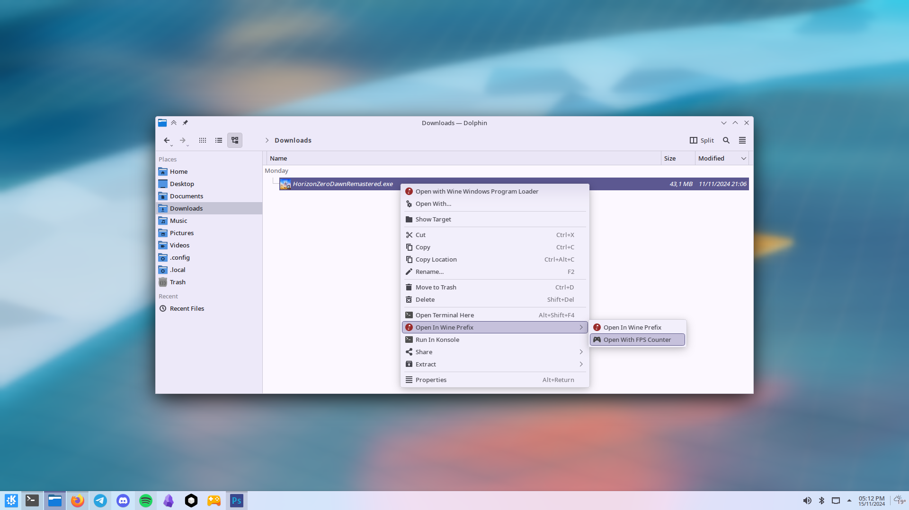
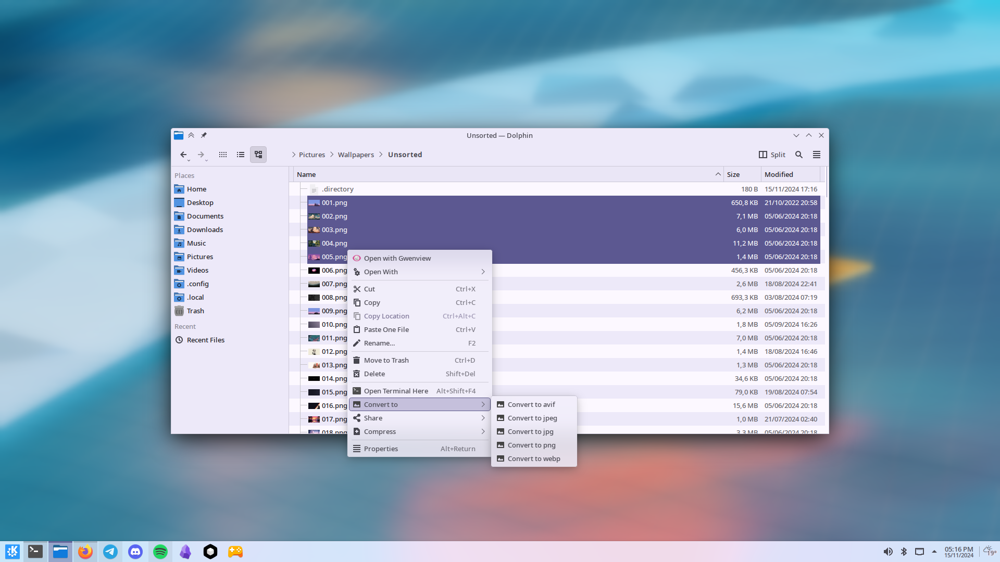

# Custom Context Menus For KDE Plasma

|                         |                         |
|          ---            |           ---           |
|  |  |

## What included

- **Open a Windows `.exe` inside given non-default prefix**
- **Open a Windows `.exe` inside given non-default prefix with [MangoHud](https://github.com/flightlessmango/MangoHud) enabled**
- **Convert any image to `png`,`jpeg`,`jpg`,`webp`,`avif`**

More soon
